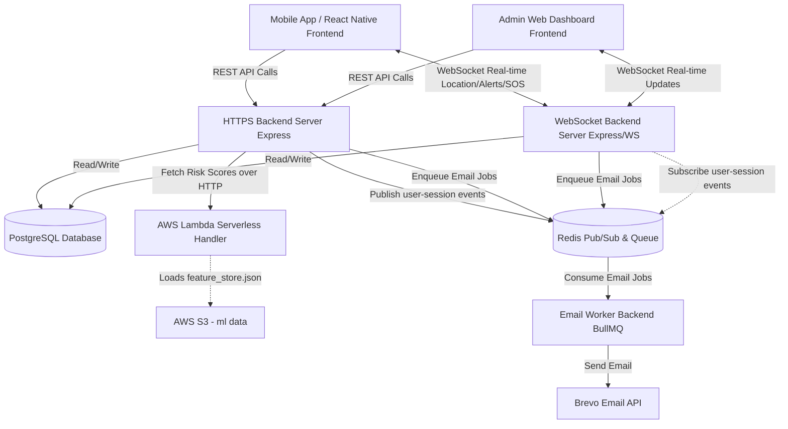
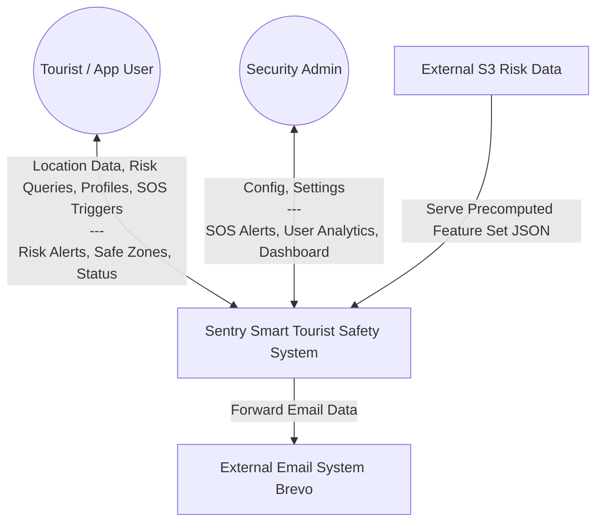
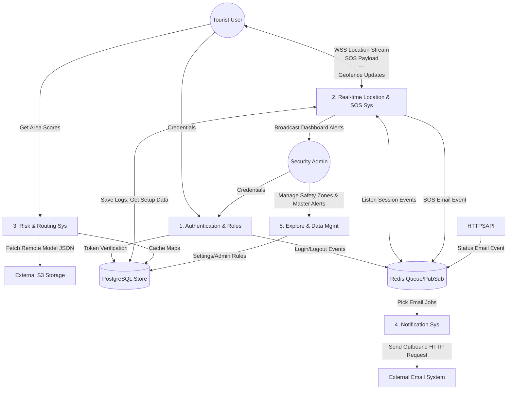
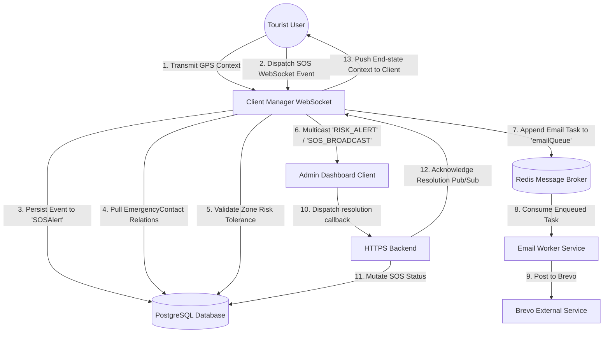
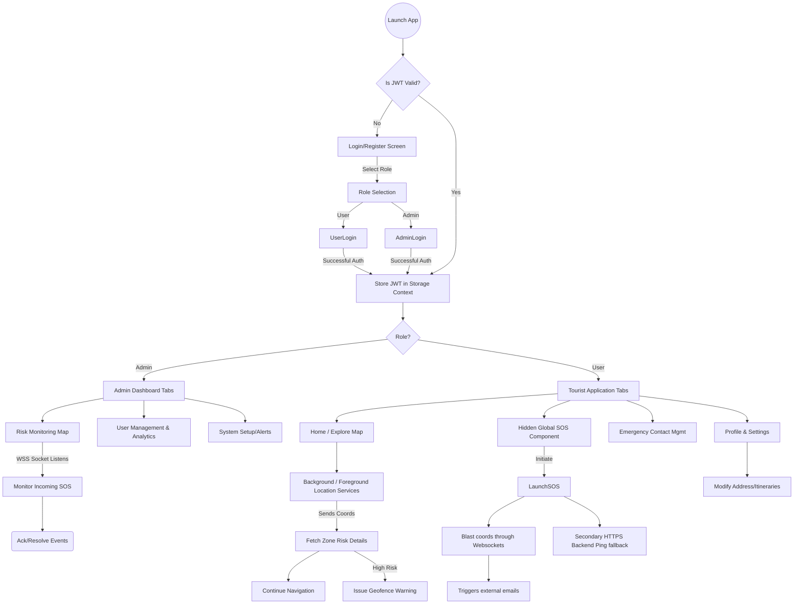

# Sentry Application Architecture Documentation

## 1. Codebase Discovery & Analysis

### 1.1 Entry Points
*   **Frontend (React Native / Expo):** Managed by Expo Router. Key layout entry points are `app/(auth)/_layout.tsx`, `app/(user-tabs)/_layout.tsx`, and `app/(admin-tabs)/_layout.tsx`.
*   **HTTPS API Backend:** `backend/https-backend/src/index.ts` (Express REST API on port 3000)
*   **WebSocket Backend:** `backend/websocket-backend/src/index.ts` (WebSocket WSS Server on port 8080)
*   **Email Worker Backend:** `backend/email-worker-backend/src/index.ts` (BullMQ worker running sequentially)
*   **ML & Serverless:** Data preprocessing pipeline in `ml/src/*.py`. Serving layer via AWS Lambda `serverless/handler.py`.

### 1.2 Module & Folder Structure
*   **`frontend/`**: View layer. `app/` contains screen layouts (file-based routing). `components/` for reusable UI chunks. `services/` abstracts API interfaces and location handlers. Context APIs (`store/`) handle App state and real-time connectivity.
*   **`backend/https-backend/`**: Primary REST implementation. Contains routes (`src/routes`), business logic (`src/services`), and Prisma configuration (`prisma/schema.prisma`).
*   **`backend/websocket-backend/`**: Specialized real-time WebSocket connection manager. `ClientManager.ts` maps clients and pushes immediate context like user tracking or emergency broadcasting.
*   **`backend/email-worker-backend/`**: Background worker utilizing BullMQ and Redis to execute deferred workflows (ex: bulk email notifications) without blocking synchronous HTTPS flows.
*   **`ml/`**: Off-platform machine learning and data engineering jobs that synthesize data sets (Crime, Accident, Safetipin, OSM, Reviews) to establish geographic Risk Categorization and Base Scores.
*   **`serverless/`**: AWS Lambda deployment code to serve pre-calculated static model data (scores) securely and affordably over network.

### 1.3 Data Flow Overview
1.  **Ingestion:** Users input data directly via Frontend views (e.g. Profile editing) or silently push constant GPS streams when tracking is enabled via Background Worklets.
2.  **Synchronous Mutates:** The React client fires standard REST requests via Axios to the HTTPS Node server which synchronously persists entities through Prisma -> Postgres.
3.  **Real-Time Subsystem:** 
    *   The WebSocket Node server listens to WSS ports, maintaining a register of User and Admin sockets.
    *   It monitors `user-session-events` subscribed from a Redis Bus. When standard HTTPS POST affects a session, it crosses the bus to the WS server to propagate back to targeted connected clients.
4.  **Asynchronous Jobs:** Large blocking tasks like outgoing Emails are dumped into Redis via the HTTPS or WS server. The headless Email Worker pops them off the Queue and invokes External APIs (like Brevo).
5.  **Analytics / ML Retrieval:** For Risk Scoring, the Express server acts as a proxy, fetching high-performance static calculations from the AWS Lambda `serverless` function sitting in front of S3 `feature_store.json`.

### 1.4 External Integrations
*   **Postgresql:** Core relational database (via Prisma).
*   **Redis:** Cache layer, message bus (Pub/Sub), and Queue (via BullMQ + ioRedis).
*   **AWS S3 & CloudWatch (Implicit via Lambda):** Stores large JSON ML datasets.
*   **Brevo (Sendinblue):** Handles outbound transactional emails for SOS notifications.
*   **Maps & Routing:** Expo Location / `react-native-maps` and OpenStreetMap logic.

### 1.5 Technology Stack
*   **Client App:** React Native, Expo, Expo Router, React Context API, Lucide Icons, i18next (localization), React Native Maps.
*   **API/Services Core:** Node.js, Express, TypeScript, Websockets (`ws`), JSON Web Tokens (JWT).
*   **Database & ORM:** PostgreSQL, Prisma ORM, Redis.
*   **Task System:** BullMQ.
*   **Machine Learning Structure:** Python (Pandas/Scikit).

### 1.6 Inter-Service Communication
*   **Frontend <-> HTTPS-backend:** HTTP REST (fetch/Axios).
*   **Frontend <-> Websocket-backend:** Persistent WSS Protocol with JSON messages.
*   **HTTPS-Backend <-> Websocket-Backend:** Redis Pub/Sub events (`user-session-events`).
*   **Backends <-> Email-worker:** Redis Queue mechanisms (`emailQueue`).
*   **HTTPS-Backend <-> Serverless/ML:** HTTPS requests via Axios.

---

## 2. Diagrams

### 2.1 System Architecture Diagram

*Summary: Demonstrates the global infrastructure array showing the isolated REST service, dedicated WebSocket service, background Task Worker, Serverless Model Proxy, and state stores interacting.*

### 2.2 Data Flow Diagram (DFD) — Level 0 (Context Diagram)

*Summary: Highlights system boundaries illustrating exactly where external users or platforms feed data into the Sentry application layer.*

### 2.3 Data Flow Diagram (DFD) — Level 1

*Summary: Decomposes the whole system into functional domains: Auth handling session states, Real-time components managing location/active crises, Risk components consulting ML models, Explore component dealing with persistent map points, and Notifications distributing external jobs.*

### 2.4 Data Flow Diagram (DFD) — Level 2 (Location / SOS Pipeline)

*Summary: Provides an exact programmatic sequence trace of how an SOS alert propagates from the moment a user initiates it, all the way through caching databases, triggering real-time WSS updates, delegating parallel email logic to an offload worker, and flowing back full circle once an administrator acts upon it.*

### 2.5 Application Flow Diagram (User Journey)

*Summary: Illustrates the decision nodes from application start, including role-handling splitting Admin dashboards vs User navigation tabs, core app loops for tourist risk monitoring via GPS, and asynchronous branches triggered by panic button integration.*

---

## 3. Data Dictionary

*A list of core relational models inside Prisma Schema shaping application states:*

| Entity | Primary Key / Index | Description / Important Fields | Path / Flow |
| :--- | :--- | :--- | :--- |
| **`User`** | `id (UUID)` | Core auth object holding `role` (USER/ADMIN), `password`, `email`. One-to-Many with many objects. | Queried fundamentally on every Auth operation. Read heavily by `websocket-backend`. |
| **`LocationLog`** | `id (UUID)`, `userId` index | Highly transactional store tracking `latitude`, `longitude`, `riskScore`, and `source` (`GPS` vs `NETWORK`). | Streamed constantly via `websocket-backend`, stored in DB. Polled occasionally by Admins. |
| **`SOSAlert`** | `id (UUID)`, `status` index | Crucial pipeline tracking record. Includes `latitude`, `longitude`, `status` (`ACTIVE`, `RESOLVED`, etc.), and snapshot of `emergencyContacts`. | Created via WS or HTTP POST. Modified during Admin interactions. Monitored for dashboard state. |
| **`SafetyZone`** | `id (UUID)` | Geofencing boundaries stored via `polygon` (GeoJSON), a defined `safetyScore`, and categorical `zoneLevel` (`SAFE`, `MODERATE`, `AVOID`). | Admins write these. The backend checks raw coords against them to dispatch User Geofence warnings. |
| **`EmergencyContact`** | `id (UUID)` | Related to `User`. Contact data including `email` and `phone` relation. | Sourced dynamically at the moment an `SOSAlert` triggers to append to the background Redis `emailQueue`. |
| **`Feature Store` (External)** | JSON object tree | Machine Learning generated dataset providing precomputed baseline risk scores aggregated by geographic boundaries. | Lives offline in AWS `S3`. Fetched dynamically by `serverless` functions responding to coordinate lookups by the HTTPS backend. |

---

## 4. Component Responsibility Table

| Module/Service | Primary Responsibility |
| :--- | :--- |
| **Express REST API (`https-backend`)** | Deals with synchronous operations like Auth, CRUD for `EmergencyContact`, fetching profile data, and requesting `SafetyZone` statistics. Proxies Data-Science model scoring endpoints. |
| **Websocket Server (`websocket-backend`)** | Completely decouples real-time GPS stream parsing, active SOS broadcasting, and dashboard administrative multicasting from standard HTTP flows preventing IO blocking. |
| **Worker Queue (`email-worker-backend`)** | Independent process preventing latency when handling slow, brittle SMTP transactional emails offloaded from WS or HTTP processes. |
| **Client Context API `store/`** | Manages application state locally across React Native tabs—specifically shielding complicated reconnect-logic around WS sockets mapping to token lifecycles. |
| **Cloud Lambda Proxy (`serverless`)** | Abstracts heavy data structure loads off the Node REST API, ensuring high concurrency capabilities when querying 10k+ preprocessed mapped polygon scores. |

---

## 5. Architectural Concerns & Observations

1.  **Asymmetry in SOS Redundancy:** SOS triggers seem to rely heavily on standard HTTP POST payloads inside `(auth)` fallbacks vs pure WebSocket logic (User code implies there's multiple connection logic to WebSockets, but if connections falter during cellular handoff, HTTP fallback is necessary). An explicit offline Queue capability synced on connectivity restore might be needed securely.
2.  **Duplicative Network Dependencies:** The `https-backend` uses Prisma to access Postgres. The `websocket-backend` also utilizes the exact same Prisma models and connects directly to the DB. Tight coupling exists at the database layer; any schema migration impacts both services simultaneously.
3.  **Cross-Origin Configuration:** The `serverless` endpoint (`handler.py`) implements wild-card CORS headers (`Access-Control-Allow-Origin: *`). For sensitive geographic analytics, this should likely be scoped specifically to the API gateway proxy layer limits or direct Sentry app signatures.
4.  **Resilience of Risk-Scores:** If AWS fails, the `https-backend/src/routes/risk-scores.ts` automatically attempts a Local Data Fallback (`../../ml/processed/feature_store.json`). If this local fallback isn't maintained on staging or production containers consistently, the endpoints will crash. Ensure static file inclusion in CI/CD pipeline Docker containers.
5.  **Scaling Pub/Sub:** Redis usage is highly effective here to bridge HTTP states and WS Clients (`user-session-events`). As horizontal instances of the `websocket-backend` scale via Kubernetes or LoadBalancers, this architecture will effortlessly synchronize Admin dashboard context identically across all PODs.
