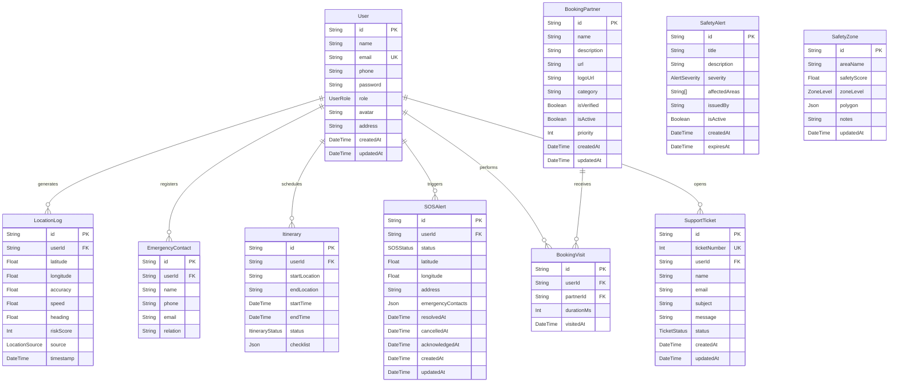
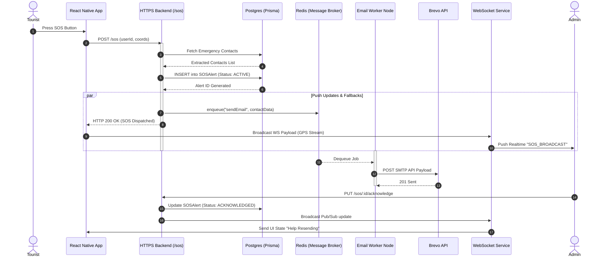
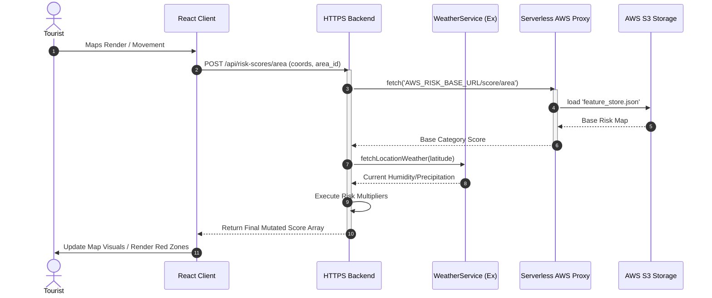
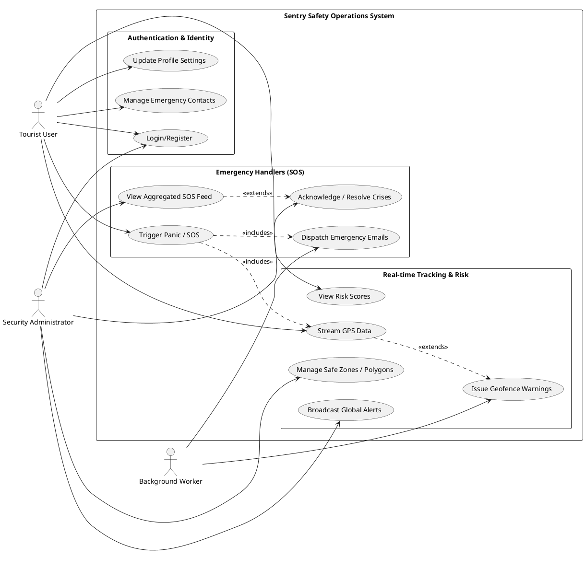

# Sentry: Deep Architectural Analysis & UML Documentation

This document represents Phase 2 of the deep architectural analysis of the Sentry codebase. It translates the raw structures, schemas, and API paths of the `frontend`, `https-backend`, `websocket-backend`, and `email-worker-backend` into formalized UML representations.

---

## DIAGRAM 1: ER DIAGRAM (Entity Relationship)

**Brief Explanation:**
This diagram showcases the complete PostgreSQL relational schema driven by Prisma. It maps the physical constraints, datatypes, and relationships for identity management, tracking, and emergency systems.

**Key Insights:**
*   **Cascade Deletes:** Almost all core operational tracking entities tightly couple heavily to the `User` object (via `userId`). If a user is deleted, all their trace data (`LocationLog`, `SOSAlert`) guarantees deletion. 
*   **Data Snapshots:** The `SOSAlert` ingeniously takes a `Json` snapshot of `emergencyContacts`. This prevents historical corruption if a user changes or removes an emergency contact after an SOS is resolved.
*   **Decoupled Geography Features:** `SafetyAlert` and `SafetyZone` are globally scoped rather than user-scoped. They define the boundaries the rest of the application runs calculations against.

---

## DIAGRAM 2: SEQUENCE DIAGRAMS

### Sequence Flow A: SOS Alert Full Lifecycle
**Brief Explanation:**
Displays the asynchronous flow of a Tourist triggering an emergency through their mobile device, up to the parallel paths of WebSockets for dashboards and Redis backing queues for external mailing.

**Key Insights:**
*   The architecture opts for immediate HTTP persistence, delegating slow exterior dependency (SMTP Emails) entirely out of the standard loop using BullMQ. 
*   Admins manage system state via traditional REST verbs which bounce back into Real-time updates via internal Pub/Sub systems pushing through the decoupled WebSockets API.

### Sequence Flow B: Geolocation Risk Scoring
**Brief Explanation:**
Depicts how the app pulls risk metrics combining local APIs and remote AWS-hosted static structures via Lambda proxy.

---

## DIAGRAM 3: USE CASE DIAGRAM

**Brief Explanation:**
Maps the primary functional business boundaries comparing what the System, Security Administrators, and Tourists can execute within the application ecosystem.

**Key Insights:**
*   **Clear Authorization Dividing Lines:** The application is split exactly dual-tenant. Geofences and map logic are strictly generated down from Administration endpoints context.
*   **Automation:** The `Background Worker` (System) exclusively drives external actions (Email, Risk Multiplier logic based on Weather, GPS evaluating polygons) shielding the Tourist layer from complex client calculations.

---

## END-TO-END ARCHITECTURE SUMMARY

The Sentry Smart Tourist application operates horizontally out of **two parallel data avenues**: a standard `HTTPS Express implementation` for deterministic configuration operations, and a `WebSocket protocol implementation` designed for handling massive, consistent asynchronous coordinate dumps and admin dashboard mutations. 

The entire framework surrounds a `PostgreSQL/Prisma` core heavily intertwined. A Tourist initializes the application, authenticating against the database, before rendering map layers fed via a proxy passing through the Express app to an external **AWS Serverless infrastructure** containing highly optimized machine learning Risk Maps. When in danger, the user triggers an `SOSAlert`. Rather than blocking the UI, this HTTP request instantaneously dumps the heavy computation into a **BullMQ Redis memory store**. This permits a headless Node worker to absorb the high-latency punishment of transmitting external SMTP jobs while simultaneously pumping the coordinates natively into the socket network alerting local administration instantly to react.
